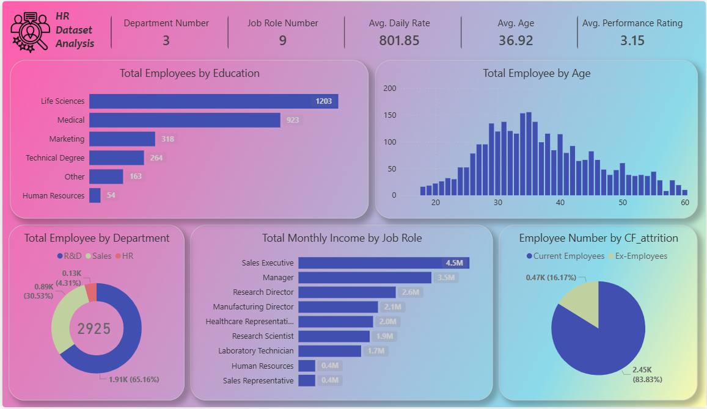

# 👩‍💼 HR Dataset Analysis Dashboard

🔗 **Repository Link**  
https://github.com/marwamohamed51/HR-Dataset-Analysis---Power-BI

---

## 📌 Project Overview

The **HR Dataset Analysis Dashboard** is an interactive **Power BI dashboard** designed to analyze employee data and provide insights into workforce demographics, income distribution, attrition, and departmental structure.

The dashboard layout and UI were **designed using Figma** before being implemented in Power BI to create a clean and professional data visualization experience.

---

## 🎨 Dashboard Design

- 🎨 **UI Designed in Figma**
- 📊 Built and developed using **Power BI**
- 📈 Interactive visuals for HR analytics
- 🖥 Modern and user-friendly layout

---

## 📸 Dashboard Preview

---

## 📊 Key Metrics

- **Department Number:** 3  
- **Job Role Number:** 9  
- **Average Daily Rate:** 801.85  
- **Average Age:** 36.92  
- **Average Performance Rating:** 3.15  

---

## 📈 Dashboard Insights

### 🔹 Total Employees by Education
Shows the distribution of employees based on their education field:
- Life Sciences
- Medical
- Marketing
- Technical Degree
- Human Resources
- Other

This helps identify the dominant educational backgrounds within the company.

---

### 🔹 Total Employees by Age
A histogram visualizing the **age distribution of employees**, helping HR understand workforce demographics.

---

### 🔹 Total Employees by Department
Displays employee distribution across departments:
- **R&D**
- **Sales**
- **HR**

This provides insight into workforce allocation across departments.

---

### 🔹 Total Monthly Income by Job Role
Compares **monthly income across different job roles**, including:
- Sales Executive
- Manager
- Research Director
- Manufacturing Director
- Healthcare Representative
- Research Scientist
- Laboratory Technician
- HR
- Sales Representative

---

### 🔹 Employee Attrition Analysis
Shows the ratio between:
- **Current Employees**
- **Ex-Employees**

This helps analyze **employee retention and attrition trends**.

---

## 🛠 Tools & Technologies

- **Power BI**
  - Data Modeling
  - DAX Measures
  - Data Visualization
- **Figma**
  - Dashboard UI Design
  - Layout and color theme

---

## 🎯 Project Goals

- Practice HR data analysis using Power BI
- Improve dashboard storytelling
- Apply UI/UX principles using Figma
- Create a professional **portfolio-ready BI project**

---

## 📂 How to Use

1. Download the `.pbix` file from the repository.
2. Open the file using **Power BI Desktop**.
3. Interact with the visuals to explore HR insights.

---

## 👩‍💻 Author

**Marwa Mohamed Aboelela**  
IT Graduate – Tanta University  
Power BI Developer | Data Analyst

---

⭐ If you like this project, feel free to **star the repository**.
